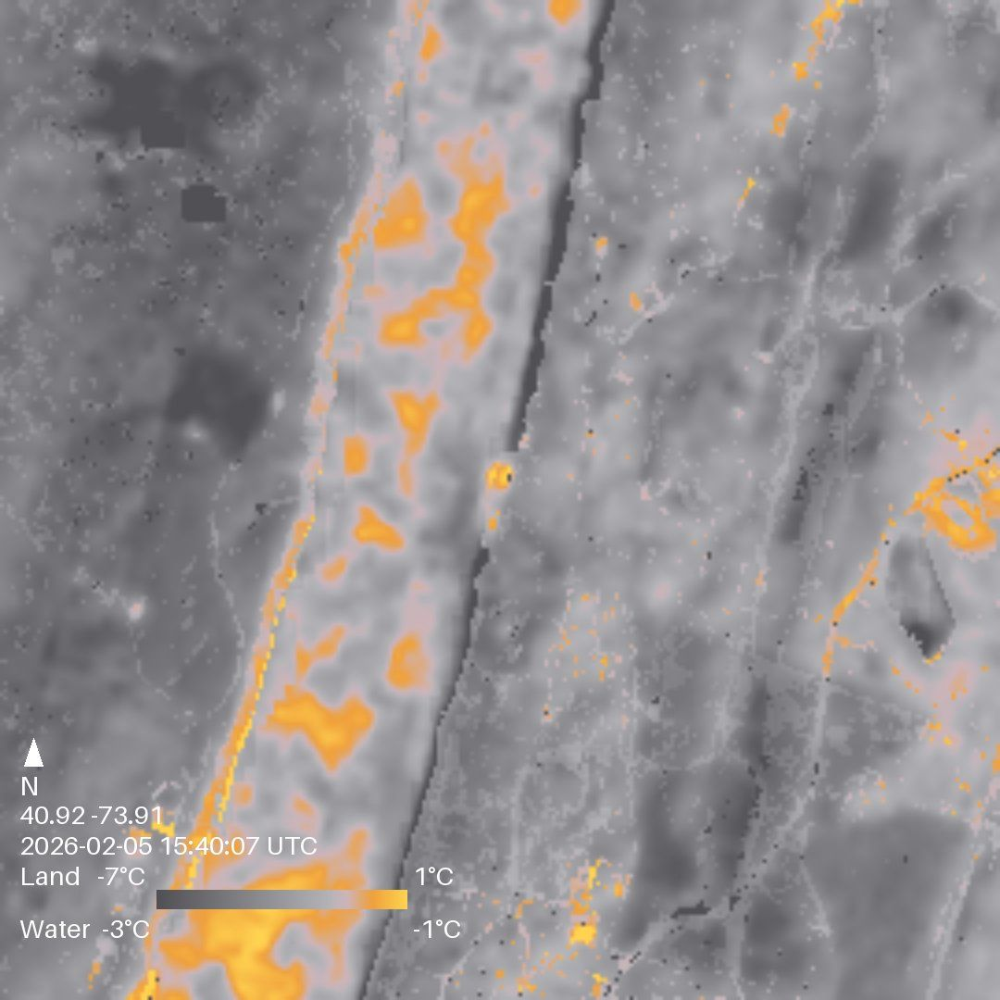
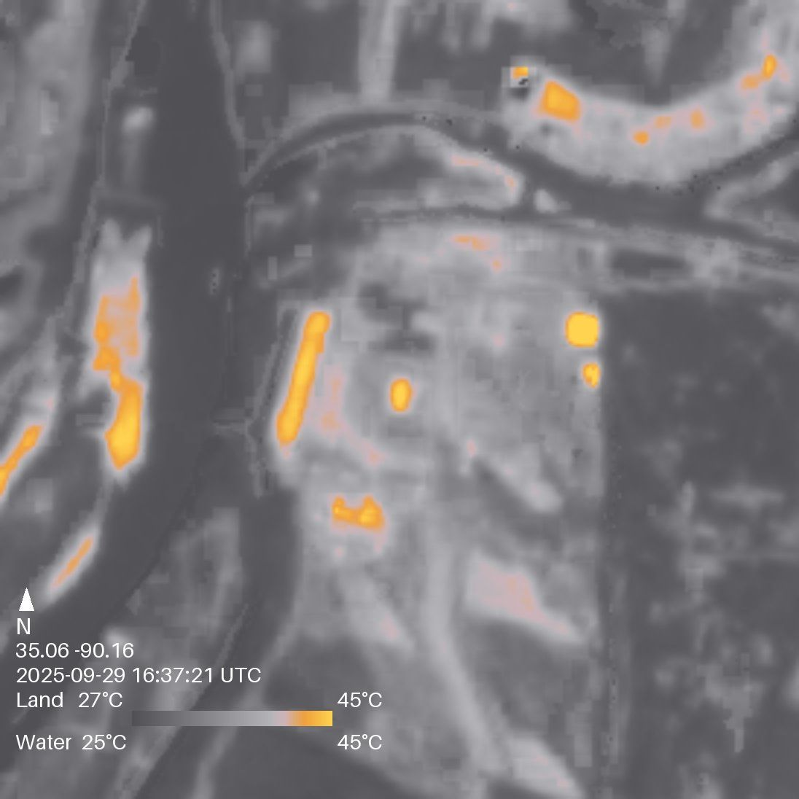
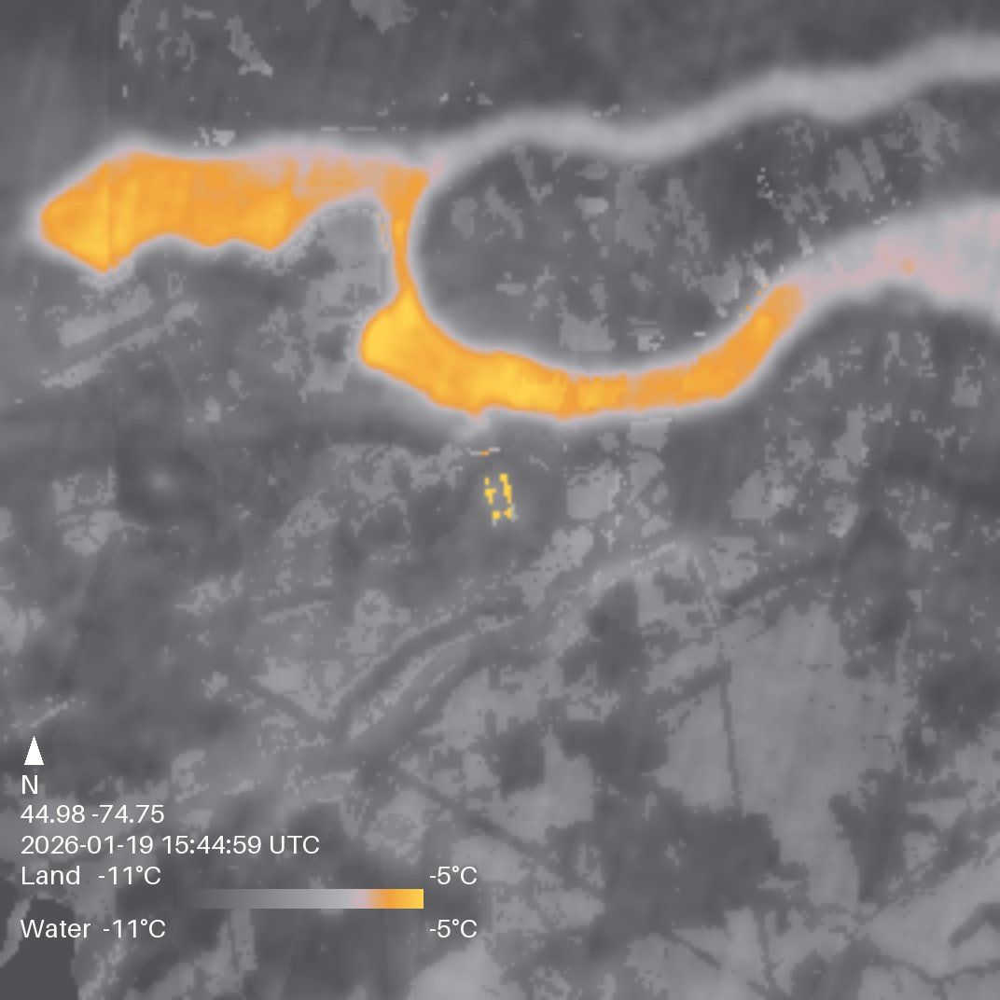

# SatPhone

Satellite thermal imagery delivered via SMS. Text a location, get back a thermal satellite image — processed on a phone running Termux and sent as MMS from your SIM number.

No cloud servers. No SaaS. No API keys. Just a phone with a data plan.

<p align="center">
  
  
  
</p>

## How It Works

```
User texts:  "therm 44.43 -110.59"
                    │
    ┌───────────────┴───────────────┐
    │  Termux daemon (sms_daemon.py)│
    │  polls SMS inbox every 5s     │
    └───────────────┬───────────────┘
                    │
    1. Parse & validate coordinates
    2. STAC search → Planetary Computer (Landsat C2 L2)
    3. Windowed COG read (~500 KB vs 100 MB full scene)
    4. Thermal colormap + land/water overlay
    5. Compress to JPEG (<100 KB for MMS)
    6. Open Messages via am start → Tasker auto-taps Send
                    │
    ┌───────────────┴───────────────┐
    │  MMS sent from your SIM #     │
    │  (~15-25s total on-device)    │
    └───────────────────────────────┘
```

## Quick Start

### Desktop / Development

```bash
git clone https://github.com/Repair-Redress/satPhone.git
cd satPhone
python -m venv .venv && source .venv/bin/activate
pip install -r requirements.txt
python main.py 44.43 -110.59          # Yellowstone
python main.py 40.92 -73.91           # Long Island Sound
```

### Termux (Android)

```bash
git clone https://github.com/Repair-Redress/satPhone.git
cd satPhone
chmod +x setup_termux.sh
./setup_termux.sh                      # installs everything (~15 min first time)
source .venv/bin/activate
python main.py 44.43 -110.59          # test the pipeline
python sms_daemon.py --tasker-help    # print Tasker setup guide
```

## SMS Commands

| Command | Description |
|---------|-------------|
| `therm <lat> <lon>` | Fetch thermal image at coordinates |
| `therm <lat> <lon> <YYYY-MM-DD>` | Fetch image before a specific date |
| `therm help` | Show help text |

Example: `therm 35.06 -90.16` → thermal image of Memphis, TN.

## Full Setup Guide

### Prerequisites

| Requirement | Source | Notes |
|-------------|--------|-------|
| Android phone with SIM | — | Tested on Moto G Power 2024 5G |
| **Termux** | [F-Droid](https://f-droid.org/packages/com.termux/) | Terminal emulator for Android |
| **Termux:API** | [F-Droid](https://f-droid.org/packages/com.termux.api/) | Separate app — grants SMS access |
| **Tasker** | [Play Store](https://play.google.com/store/apps/details?id=net.dinglisch.android.taskerm) | Automation (~$3.99) |
| **AutoInput** | [Play Store](https://play.google.com/store/apps/details?id=com.joaomgcd.autoinput) | Tasker plugin (free) |

> **Important:** Install Termux and Termux:API from **F-Droid**, not the Play Store. The Play Store versions are outdated and won't work together.

### Step 1: Termux Setup

```bash
# Clone the repo
git clone https://github.com/Repair-Redress/satPhone.git
cd satPhone

# Run the setup script (installs Python, GDAL, numpy, rasterio, etc.)
chmod +x setup_termux.sh
./setup_termux.sh

# Install the Termux:API bridge (after installing the Termux:API app)
pkg install termux-api

# Grant shared storage access (tap Allow when prompted)
termux-setup-storage
```

The setup script handles:
- System dependencies (Python, GDAL, proj, libjpeg, OpenBLAS, Rust)
- Pre-compiled packages from `tur-repo` when available
- Fallback source compilation with Termux-specific build flags
- Virtual environment with `--system-site-packages`
- Shared storage directory for MMS images

### Step 2: Grant Permissions

On the phone, go to **Settings → Apps** and grant these permissions:

| App | Permissions |
|-----|-------------|
| **Termux** | (none needed beyond install) |
| **Termux:API** | SMS, Phone, Storage |
| **Tasker** | Display over other apps |
| **AutoInput** | Accessibility service (Settings → Accessibility → AutoInput → ON) |

### Step 3: Tasker Configuration

Open Tasker and enable external access:
- **Three dots → Preferences → Misc → Allow External Access → ON**

#### Create the Task

1. Go to the **TASKS** tab → tap **+** → name it **SatPhone Tap Send**
2. Add these 3 actions:

| # | Action | Settings |
|---|--------|----------|
| 1 | Task → **Wait** | Seconds: `3` |
| 2 | Plugin → AutoInput → **Action** | Action: `Click`, Text: `MMS` |
| 3 | App → **Launch App** | App: `Termux` |

> **Why Launch Termux, not Go Home?** Android 14 blocks apps from starting activities in the background. Returning to Termux keeps it in the foreground so it can open Messages for the next MMS.

#### Create the Profile

1. Go to the **PROFILES** tab → tap **+** → **Event** → **System** → **Intent Received**
2. Set **Action** to: `com.satphone.TAP_SEND`
3. Leave everything else blank
4. Tap back → link it to task **SatPhone Tap Send**
5. Make sure the profile toggle is **ON** (green)

### Step 4: Test

```bash
source .venv/bin/activate

# Test the image pipeline alone
python main.py 44.43 -110.59

# Test the full MMS flow (sends a test image)
python sms_daemon.py --test-mms "+1YOURNUMBER"
```

The MMS test should:
1. Open Google Messages with the image and recipient
2. After 3 seconds, AutoInput taps Send
3. Return to Termux

### Step 5: Run the Daemon

```bash
source .venv/bin/activate

# Foreground (see logs in real time)
python sms_daemon.py

# Background (persists after closing terminal)
nohup python sms_daemon.py &
```

Text the phone `therm 44.43 -110.59` from another device. You should get a thermal image MMS back in ~20 seconds.

## How the MMS Flow Works

Sending MMS from Termux is non-trivial — there's no `termux-mms-send` API. Here's how SatPhone solves it:

```
sms_daemon.py                        Tasker + AutoInput
─────────────                        ──────────────────
1. Copy JPEG to /storage/emulated/0
   (shared storage — all apps can read)

2. termux-media-scan registers the
   file with Android MediaStore

3. am start → opens Google Messages
   with image + recipient pre-filled
   (Termux has foreground permission)

4. am broadcast com.satphone.TAP_SEND
   ─────────────────────────────────→  Intent Received fires
                                       Wait 3 seconds
                                       AutoInput taps "MMS"
                                       Launch Termux
                                           │
5. Daemon waits 10s cooldown               │
   (prevents next MMS from colliding)      ↓
                                       MMS sent from SIM
```

**Why this architecture?**
- Android 14 blocks background apps from starting activities → Termux must be in the foreground to open Messages
- `file://` URIs under Termux's private dir (`/data/data/com.termux/...`) are invisible to other apps → images must be in `/storage/emulated/0/`
- Freshly copied files aren't in Android's MediaStore → `termux-media-scan` is required
- Google Messages reuses existing activities and ignores new intents → `--activity-clear-task` forces a fresh start

## Troubleshooting

### MMS not sending

| Symptom | Fix |
|---------|-----|
| Messages app doesn't open | Termux is in the background. Tap Termux first, or ensure Tasker's last action is "Launch Termux" |
| Messages opens but no image | Run `termux-setup-storage`. Check `/storage/emulated/0/Pictures/SatPhone/` exists |
| AutoInput times out | Wrong button text. Open Messages, compose an MMS, and use AutoInput → UI Query to find the Send button's text label |
| Second MMS fails | Tasker's last action must be "Launch App: Termux", not "Go Home" |
| `termux-sms-list` error | Install the Termux:API **app** from F-Droid, then `pkg install termux-api`. Grant SMS permission. |

### Send button label

The AutoInput click text (`MMS`) works for Google Messages. If you use a different messaging app:

1. Open your messaging app and compose an MMS
2. In Tasker, create a temp task: Plugin → AutoInput → **UI Query**
3. Run it — it lists all on-screen UI elements
4. Find your Send button's `text` value
5. Update Action 2 in the Tasker task

### Pipeline errors

| Symptom | Fix |
|---------|-----|
| No scenes found | Try different coordinates or a date range. Cloud cover filters may reject all results. |
| Import errors | Rerun `setup_termux.sh`, or `pip install <package>` manually |
| Memory errors | The 4GB phone can handle the windowed reads, but avoid running other heavy apps simultaneously |

## Project Structure

```
satPhone/
├── main.py              Pipeline orchestrator
├── config.py            All configuration constants
├── thermal.py           STAC search + satellite data fetching
├── imaging.py           Thermal colormap + overlay processing
├── sms.py               SMS message parsing + validation
├── sms_daemon.py        SMS daemon + MMS sending + Tasker guide
├── rate_limit.py        Rate limiting + abuse protection
├── logger.py            Rotating file + console logging
├── setup_termux.sh      One-command Termux setup
├── requirements.txt     Python dependencies
├── examples/            Example thermal images
│   ├── thermal_40.92_-73.91_*.jpg    Long Island Sound
│   ├── thermal_35.06_-90.16_*.jpg    Memphis, TN
│   ├── thermal_43.28_-77.31_*.jpg    Rochester / Lake Ontario
│   └── thermal_44.98_-74.75_*.jpg    St. Lawrence River
├── thermal_output/      Generated images (gitignored)
├── satphone.db          SQLite database (gitignored)
└── satphone.log         Log files (gitignored)
```

## Configuration

All constants live in `config.py`:

| Setting | Default | Description |
|---------|---------|-------------|
| `AREA_SIZE_KM` | 4 | Image area (km × km) |
| `SCENE_CLOUD_MAX` | 85 | Max scene-level cloud cover % |
| `LOCAL_CLEAR_MIN` | 50 | Min locally-clear pixels % |
| `STAC_CANDIDATES` | 10 | Scenes to check per request |
| `JPEG_QUALITY` | 85 | Output JPEG quality |
| `SMS_POLL_INTERVAL` | 5 | Seconds between inbox polls |
| `MESSAGING_PACKAGE` | `com.google.android.apps.messaging` | Messaging app package name |
| `DEBUG` | False | Enable tracemalloc profiling |

## Data Sources

- **Satellite imagery:** [Microsoft Planetary Computer](https://planetarycomputer.microsoft.com/) (free, no API key)
- **Collection:** Landsat Collection 2 Level 2 (`landsat-c2-l2`)
- **Thermal band:** `lwir11` (Band 10, thermal infrared)
- **Land/water mask:** ESA WorldCover v2.0
- **Format:** Cloud Optimized GeoTIFF — windowed reads pull only the needed ~4 km² area

## Persistence

These runtime files are **gitignored** — `git pull` will never overwrite or delete them:

| File | Purpose |
|------|---------|
| `satphone.db` | SQLite database (rate limits, message tracking) |
| `satphone.log` | Rotating log files |
| `thermal_output/*.jpg` | Generated thermal images |
| `/storage/emulated/0/Pictures/SatPhone/` | MMS copies (on device only) |

## Target Hardware

Designed for constrained Android devices via Termux:

- **Tested on:** Moto G Power 2024 5G (4 GB RAM, MediaTek Dimensity 7020)
- **Pipeline time:** ~15-25 seconds on-device (~8 seconds on desktop)
- **Memory:** Windowed COG reads keep usage at ~500 KB per request vs 100 MB for full scenes
- **Output:** <100 KB JPEG, optimized for MMS delivery

## License

MIT
